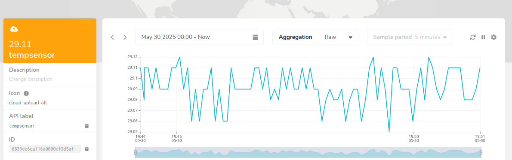

# Lab Module 12 - Semester Project - Final Write-up

NOTE: Be sure to implement all the Lab Module 12 requirements listed at Lab Module 12.

## Description

Describe your idea in 1 paragraph (at least 2 or 3 sentences).

Este proyecto implementa un sistema básico de Internet de las Cosas (IoT) que permite la monitorización de sensores ambientales y el rendimiento del sistema de un dispositivo restringido (CDA) y un Gateway Device (GDA). La comunicación entre estos dispositivos y un servicio en la nube (Ubidots) se establece utilizando el protocolo MQTT seguro. La plataforma en la nube se utiliza para visualizar los datos recolectados y enviar comandos para controlar actuadores conectados al CDA.

## What - The Problem 

What problem did you tackle and why does it matter? Write 1 to 2 paragraphs in response.

El problema abordado es la necesidad de recopilar, transmitir y visualizar datos de dispositivos IoT en tiempo real, así como la capacidad de controlar estos dispositivos de forma remota.

## Why - Who Cares? 

Why do you care about this particular problem? Write 1 to 2 paragraphs in response.

La monitorización y el control remoto de dispositivos tienen un impacto significativo en numerosas industrias y en la vida cotidiana. Desde la optimización del consumo energético en hogares y edificios hasta la mejora de la eficiencia en procesos industriales y la creación de entornos más seguros y cómodos, el IoT ofrece soluciones con un gran potencial. La capacidad de acceder a datos en tiempo real y controlar dispositivos de forma remota no solo mejora la eficiencia operativa sino que también habilita nuevos modelos de negocio y servicios personalizados. Participar en este proyecto me permite entender y contribuir a la construcción de estos sistemas inteligentes que están transformando la manera en que interactuamos con nuestro entorno.

## How - Expected Technical Approach

Write 1 to 2 paragraphs describing the outcomes you achieved.

Logramos implementar un flujo de datos bidireccional entre el CDA, el GDA y Ubidots. El CDA recolecta datos de sensores (temperatura, humedad, presión) y rendimiento del sistema (CPU, memoria, disco) y los envía al GDA a través de MQTT/TLS. El GDA, a su vez, procesa estos datos, recolecta su propio rendimiento del sistema y reenvía toda la telemetría a Ubidots utilizando MQTT/TLS. Configuramos Ubidots para recibir y visualizar estos datos correctamente bajo un único dispositivo (`constraineddevice001`). Además, habilitamos la capacidad de enviar comandos de actuación desde Ubidots al GDA, que los reenvía al CDA para controlar un actuador (simulado o real).

Con la implementación, pudimos demostrar la conectividad segura, la recolección y transmisión de múltiples tipos de datos de telemetría, la visualización de estos datos en la nube y el control remoto básico de un actuador. Aunque enfrentamos desafíos con la correcta configuración y el manejo de errores en la comunicación y el formato de datos para Ubidots, logramos superar la mayoría de estos problemas para establecer una comunicación funcional y segura, aunque persistan algunos errores de linter que no impiden la ejecución básica.

### System Diagram

Embed a block diagram depicting your overall design, including the CDA, GDA, and Cloud Services interactions.
Be sure to include arrows depicting data flow from one application / service to the next.

El diagrama de bloques representa tres componentes principales: el CDA (Constrained Device), el GDA (Gateway Device) y el CSF (Cloud Service Functions - Ubidots). El CDA se comunica con el GDA utilizando MQTT/TLS, enviando datos de sensores y rendimiento del sistema, y recibiendo comandos de actuación. El GDA actúa como intermediario, comunicándose con el CDA (MQTT/TLS) y con Ubidots (MQTT/TLS). El GDA envía todos los datos de telemetría (del CDA y propios) a Ubidots y recibe comandos de actuación desde Ubidots. Ubidots proporciona la interfaz para visualizar los datos y enviar comandos remotos.

### What THREE (3) sensors and ONE (1) actuator did you use (add more if you wish)?

- CDA Sensor 1: Temperatura

- CDA Sensor 2: Humedad

- CDA Sensor 3: Presión

- CDA Actuator 1: Actuador LED (simulado/emulado)

### What ONE (1) CDA protocol and TWO (2) GDA protocols did you implement (add more if you wish)?

- CDA to GDA Protocol: MQTT/TLS

- GDA to CDA Protocol: MQTT/TLS (para reenviar comandos de actuación)

- GDA to Cloud Protocol: MQTT/TLS

- Cloud to GDA Protocol: MQTT/TLS (para comandos de actuación)

 
### What TWO (2) cloud services / capabilities did you use (add more if you wish)?

- Cloud Service 1 (data ingress - all inputs): Ubidots (ingesta y visualización de telemetría vía MQTT)

- Cloud Service 2 (data egress - all actuation events): Ubidots (envío de comandos de actuación vía MQTT)

## Screen Shots Representing Cloud Services

### Screen Shots Representing Visualized Data

NOTE: Include (at least) TWO (2) screen shots - one showing at least 1 hour
of time-series data from the CDA, and one showing an event being triggered
that results in an actuation event sent to your GDA and then to your CDA.

EOF.
